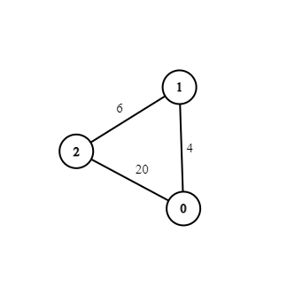
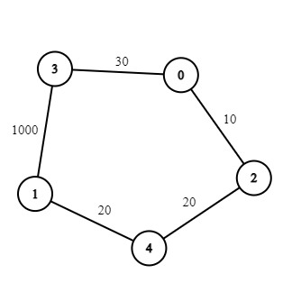
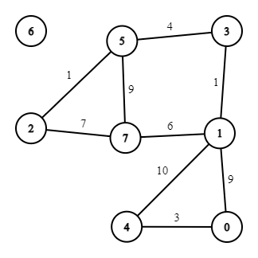
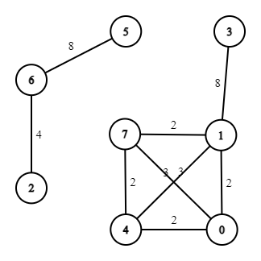

# POP_PROJEKT_22Z
_Richad Staszkiewicz, Andrzej Bednarczyk_

## Zadanie
_Zaimplementować i przetesotować algorytm A\* dla zadania znalezienia ścieżki o najmniejszej wadze od punktu A do B. Wejściem aplikacji jest plik z listą krawędzi grafu (dla każdej krawędzi zdefiniowany jest punkt początkowy, końcowy i waga krawędzi). Wyjściem aplikacji jest najkrótsza scieżka od punktu A do punktu B. Porównać działanie algorytmu A\* z "brutalnym" przeszukiwaniem grafu. Zastosowanie dodatkowego algorytmu będzie dodatkowym atutem przy ocenie projektu._

## Interpretacja
Mając przykładowe wejście w postaci pliku zawierającego:
1. W pierwszej linii: W (liczba wierzchołków), K (liczba krawędzi), P (liczba zapytań)
2. W następnych K liniach: S1 (nr wierzchołka początkowego), S2 (nr wierzchołka końcowego), D (odległość)
3. W następnych P liniach: S1 (nr wierzchołka początkowego), S2 (nr wierzchołka końcowego)

Przykład takiego pliku w postaci `test1` znajduje się poniżej:
```txt
3 3 1
0 1 4
1 2 6
0 2 20
0 2
```

Spodziewaną odpowiedzią programu `main.cpp` jest plik .csv zawierający P linii o formacie:
```txt
[Odległość brut], [Odległość A*], [Odległość Dijkstra], [Czas brut], [Czas A*], [Czas Dijkstra]
```

## Rozwiązanie
Zaimplementowano klasę Graph do przechowywania reprezentacji grafu.

W trakcie prac zaimplementowano następujące algorytmy:
1. A* - obsługiwany przez klasę Astar
2. Dijkstra - obsługiwany przez klasę Dijkstra
3. Bellman-Ford - uznawany za brutalne przeszukiwanie, obsługiwany przez klasę Brut

Oprogramowanie tworzono z pomocą technik TDD na z testowaniem na podstawie biblioteki GTest. Każda z klas jest testowana w osobnym pliku i była tworzona rozdzielnie od reszty.


## Omówienie algorytmów

### Brutalny
Algorytm brutalny przeszukuje wyczerpująco zbiór rozwiązań algorytmem Bellmana-Forda znajdując minimalną ścieżkę. Algorytm |V-1| razy rozpręża każdą krawędź, sprawdzając czy z jej pomocą odległość między startem a celem się zmniejszy. Działa w złożoności O(VE).

### Dijkstra
Algorytm Dijkstry przeszukuje graf na podstawie ciągłego rozszerzania podobnego do BFS, gdzie kolejka jest parametryzowana odległością od wierzchołka startowego. Ze względu na użycie bibliotecznej struktury kolejki priorytetowej zaimplementowanej w oparciu o kopiec Fibbonacciego, a więc dodającej log przy każdym włożeniu do kolejki, złożoność czasowa algorytmu wynosi O((V+E)logV)

### A*
Algorytm A* ma idę taką samą ajk Dijkstra, ale kolejkę parametryzuje nie odległość rzeczywista wierzchołka początkowego, a jej suma z estymowaną heurystycznie odległością wierzchołek-cel. W tym konkretnym zadaniu, ponieważ graf nie leży w metryce miejskiej na potrzeby algorytmu założono że posiadamy wcześniejszzą informację o ilości krawędzi dzielących wierzchołek od celu. Wówczas funkcja heurystyczna dopuszczalna i monotoniczna przy założeniu dodatnich krawędzi sprowadza się do założenia, że na ścieżce prowadzącej do celu znajdują się tylko krawędzie o najmniejszej długości w grafie. Ze względu na heurystyczną naturę rozwiązania nie można przeprowadzić analizy złożoności czasowej, jednak można bezpiecznie przyjąć że przy dobrze dobranej funkcji heurystycznej algorytm w najgorszym wypadku prawie wszędzie degraduje się do algorytmu Dijkstry o złożoności O((V+E)logV).

## Grafy testowe
### Test 1
Prosty graf w kształcie trójąta. Jedyne zapytanie prosi o najkrótszą ścieżkę pomiędzy wierzchołkami przebiegającą przez trzeci z nich.



### Test 2
Większy graf w formie cyklu. Jedyne zapytanie prosi o drogę między sąsiednimi wierzchołkami, gdzie optymalna droga prowadzi nei przez łączącą krawędź, a przez całą resztę cyklu.



### Test 3
Średniej wielkości graf łączący punktem artykulacji cykl z grafem o dwóch obiegach. Jeden punkt pozostaje bez połączeń. Jedyno zapytanie prosi o znalezienie drogi pomiędzy punktem w cyklu a jednym z punktów artykulacyjnych obiegów. Drugie prosi o znalezienie ścieżki z punktu wolnego do grafu.



### Test 4
Średniej wielkości graf rozłączny skłądający się z kliki 4 wierzchołków z dołączoną krawędzią do piątego i łańcucha trzech wierzchołków. Pierwsze zapytanie prosi o znalezienie ścieżki pomiędzy kliką a łańcuchem.



### Testy weryfikacyjne
Testy weryfikacyjne wygenerowano z pomocą generatora zamieszczonego koło plików przy założeniu że krawędzie grafu są nieujemnymi losowymi wartościami nie większymi od 1000.

| Graf | Ilość wierzchołków | Ilość krawędzi | Ilość zapytań | cechy |
| :---: | :---: | :---: | :---: |  :---: |
| test5 | 1 000 | 499 500 | 1 | Graf pełny |
| test6 | 10 000 | 9 999 | 1 | Ścieżka |
| test7 | 25 000 | 24 999 | 1 | Ścieżka |
| test8 | 100 | 2 442 | 1 | Graf randomizowany |
| test9 | 1 000 | 249 987 | 1 | Graf randomizowany |
| test10 | 25 000 | 3 127 883 | 1 | Graf randomizowany |
| test11 | 50 000 | 1 249 505 | 1 | Graf randomizowany |
| test12 | 1 000 | 1 000 | 1 | Cykl |

## Rezultaty

Podczas badania pominięto testy 1-4 ze względu na małą wielkość.

### Czasowe
Podczas przeprowadzania testów otrzymano następujące rezultaty czasowe:
| Graf | Ilość zapytań | Brut | Dijkstra | A* | Jednostka czasu |
| :---: | :---: | :---: | :---: | :---: | :---: |
| test5 | 1 | 1.05057e+09 | 1.26856e+07 | 1.21804e+07 | nanosekundy |
| test6 | 1 | 2.49062e+08 | 1300 | 1500 | nanosekundy |
| test7 | 1 | 1.40687e+09 | 3500 | 1400 | nanosekundy |
| test8 | 1 | 572200 | 54600 | 60500 | nanosekundy |
| test9 | 1 | 5.04779e+08 | 6.7618e+06 | 6.6838e+06 | nanosekundy |
| test10 | 1 | 1.72827e+11 | 7.88311e+07 | 7.6898e+07 | nanosekundy |
| test11 | 1 | 1.71237e+11 | 5.80524e+07 | 5.68417e+07 | nanosekundy |
| test12 | 1 | 2.6189e+06 | 12700 | 500 | nanosekundy |

### Optymalizacyjne
Podczas przeprowadzania testów otrzymano następujące rezultaty optymalizacji długości ścieżki:
Rozpatrywane jest pierwsze zapytanie każdej serii.
| Graf | Optimum globalne | Brut | Dijkstra | A* |
| :---: | :---: | :---: | :---: | :---: |
| test5 | 12 | 12 | 12 | 12 |
| test6 | 19 | 19 | 19 | 19 |
| test7 | 426 | 426 | 426 | 426 |
| test8 | 156 | 156 | 156 | 156 |
| test9 | 26 | 26 | 26 | 26 |
| test10 | 49 | 49 | 49 | 49 |
| test11 | 256 | 256 | 256 | 256 |
| test12 | 124 | 124 | 124 | 124 |


## Dyskusja wyników

### Rezultaty optymalizacji
Wskazać należy że odległości uzyskane przez każdy algorytm są odległościami równymi i globalnnie optymalnymi. O ile algorytmy Dijkstry oraz Bellmana-Forda są formalnie zobligowane do takiego zachowania, o tyle przy algorytmie A* może być to wprowadzać w konsternację.
Prostym uzaasadnieniem takich rezultatów, jest fakt iż dla dobranej funkcji heurystycznej można przeprowadzić dowód że podejmowane przez nią decyzje będą nie gordze niż te podejmowane przez algorytm Dijkstry (wynika to z jej dopuszczalności i monotoniczności). W związku z tą informacją, wiedząc że pierszą wyszukaną ścieżką przez algorytm Dijkstry jest optimum przez implikację przenosimy tę cechę na obecnie przedstawioną implementację A*.

### Interesujące zależności
#### Graf pełny
W grafie pełnym można zaobserwować prawie że degenerację algorytmu A* do algorytmu Dijkstry, co potwierdzają rezultaty czasowe. Ponieważ wyznacznik heurystyki, tj. odległość w krawędziach od punktu końcowego jest wszędzie równa 1, wartość heurystyki prawie wszędzie taka sama (oprócz oczywiście punktu końcowego). Wciąż jest on potencjalnie marginalnie szybszy ze względu na drobną preferencję w stosunku do wybrania punktu końcowego (dokładniej - punkt końcowy ma odległość zmniejszoną o wagę najmniejszej krawędzi), co ma znaczenie odwrotnieproporcjonalne do wariancji rozkładu wag w grafie. Algorytm brutalny przeszukując każdą ścieżkę grafu pełnego jest postawiony przed najmniej optymalnym przypadkiem możliwym dla zadanej wymiarowości V.

#### Ścieżka
W grafie o formie ścieżki zapytania w przeprowadzonych eksperymentach dotyczyły wierzchołków leżących obok siebie. Algorytm A* sprawdza się najlepiej, coraz bardziej zniechęcany heurystyką do poruszania się w złym kierunku, w którym Dijkstra będzie się poruszała tak długo, póty suma wag przebytej ścieżki nie będzie większa od wagi krawędzi łączącej start z celem. Ponieważ wagi zainicjowane są losowo, ilość sprawdzonych przez Dijkstrę wierzchołków będzie miała rozkład geometryczny o parametrze 0.5. Rozwiązanie brutalne tymczasem jest postawione przed najoptymalniejszym przypadkiem grafu spójnego, działając jednak wciąż nieakceptowalnie wolno.

## Dokumentacja
Dokumentacja została skompilowana na podstawie komentarzy z pomocą narzędzia DoxyGen i generuje się po skonfigurowaniu projektu CMake w katalogu głównym projektu w folderze `doc` w formie HTML oraz LaTeX. Wskazane w raporcie wizualizacje grafów dokonano z pomocą narzędzia https://csacademy.com/app/graph_editor/.

## Licencja
MIT GNU Open Licence
