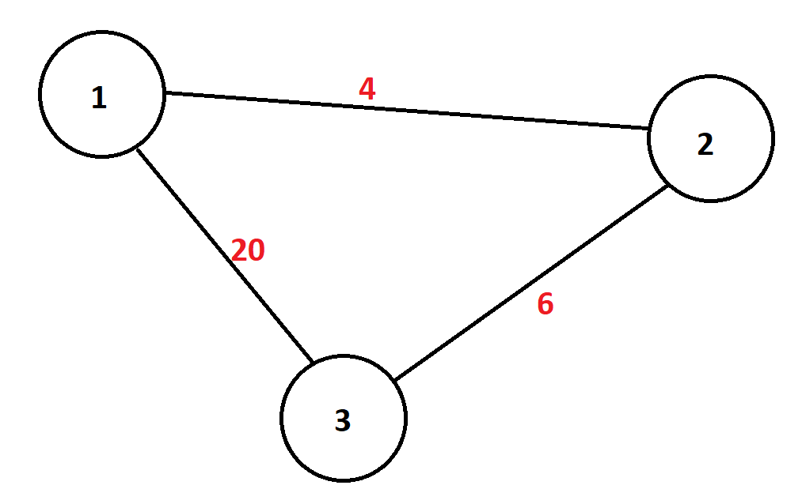

# POP_PROJEKT_22Z
_Richad Staszkiewicz, Andrzej Bednarczyk_

## Zadanie
Zaimplementować i przetesotować algorytm A\* dla zadania znalezienia ścieżki o najmniejszej wadze od punktu A do B. Wejściem aplikacji jest plik z listą krawędzi grafu (dla każdej krawędzi zdefiniowany jest punkt początkowy, końcowy i waga krawędzi). Wyjściem aplikacji jest najkrótsza scieżka od punktu A do punktu B. Porównać działanie algorytmu A\* z "brutalnym" przeszukiwaniem grafu. Zastosowanie dodatkowego algorytmu będzie dodatkowym atutem przy ocenie projektu.

## Interpretacja
Mając przykładowe wejście w postaci pliku zawierającego:
1. W pierwszej linii: W (liczba wierzchołków), K (liczba krawędzi), P (liczba zapytań)
2. W następnych K liniach: S1 (nr wierzchołka początkowego), S2 (nr wierzchołka końcowego), D (odległość)
3. W następnych P liniach: S1 (nr wierzchołka początkowego), S2 (nr wierzchołka końcowego)

Przykład takiego pliku i konstruowanego przezeń grafu znajduje się poniżej:

```txt
3 3 1
0 1 4
1 2 6
0 2 20
0 2
```

Spodziewaną odpowiedzią programu `main.cpp` jest plik .csv zawierający P linii o formacie:
```txt
[Odległość brut], [Odległość A*], [Odległość Dijkstra], [Czas brut], [Czas A*], [Czas Dijkstra]
```

## Rozwiązanie
Zaimplementowano klasę Graph do przechowywania reprezentacji grafu.

W trakcie prac zaimplementowano następujące algorytmy:
1. A* - obsługiwany przez klasę Astar
2. Dijkstra - obsługiwany przez klasę Dijkstra
3. Brut - obsługiwany przez klasę Brut

Oprogramowanie tworzono z pomocą technik TDD na z testowaniem na podstawie biblioteki GTest. Każda z klas jest testowana w osobnym pliku i była tworzona rozdzielnie od reszty.


## Testy
### Test 1
Prosty graf w kształcie trójąta przedstawiony w dziale Interpretacja.

### Test 2
Większy graf w formie cyklu. Jedyne zapytanie prosi o drogę między sąsiednimi wierzchołkami, gdzie optymalna droga prowadzi nei przez łączącą krawędź, a przez całą resztę cyklu.

### Test 3
Średniej wielkości graf łączący punktem artykulacji cykl z grafem o dwóch obiegach. Jeden punkt pozostaje bez połączeń. Jedyno zapytanie prosi o znalezienie drogi pomiędzy punktem w cyklu a jednym z punktów artykulacyjnych obiegów. Drugie prosi o znalezienie ścieżki z punktu wolnego do grafu.

## Dokumentacja
Dokumentacja została skompilowana na podstawie komentarzy z pomocą narzędzia DoxyGen. Wskazane w raporcie wizualizacje grafów dokonano z pomocą narzędzia https://csacademy.com/app/graph_editor/.

## Licencja
MIT GNU Open Licence
